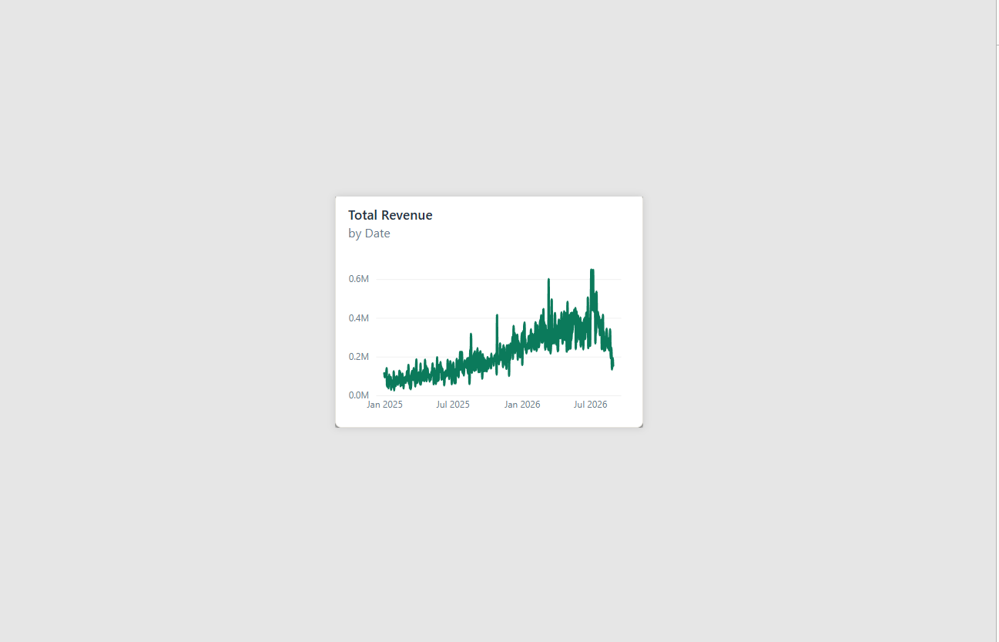

# Customer 360 — E-commerce Growth & Retention Intelligence

An end-to-end analytics project that takes raw, messy e-commerce transaction data through **SQL analysis → Python data cleaning & RFM segmentation → an interactive Power BI dashboard**, to answer one core business question:

> **Where is revenue actually coming from, which customers are worth protecting, and where is the business leaking value?**

[CONFIRM: 1–2 sentence business problem statement — replace this with your original Phase 1 framing if you have one, e.g. "A mid-size e-commerce retailer has no unified view of customer value or churn risk. This project builds that view from raw order data to support retention and acquisition decisions."]

---

## 📊 Headline Numbers

| Metric | Value |
|---|---|
| Total Revenue (completed orders) | **₹131M** |
| Total Profit | **₹53.83M** |
| Total Orders | **23K** |
| Total Customers | **5,000** |
| Purchasing Customers | **5K** |
| Repeat Customers | **4K** |
| Repeat Purchase Rate | **78%** |
| Average Order Value (AOV) | **₹5.60K** |
| Total Products | **130** |
| Avg Margin % | **40.96%** |
| At-Risk Customers | **1,137** |
| Revenue at Risk | **₹44.85M (34% of total revenue)** |
| Lost Customers | **1,163** |
| Top 20% Revenue Contribution | **55.48%** |
| Cancellation Rate | **7.84%** |

*(Pulled directly from the Executive Overview, Product Performance, and Retention & Opportunity pages — update any numbers here if they shift after your final bug-fix pass.)*

---

## 🧰 Tech Stack

- **SQL (PostgreSQL syntax)** — revenue analysis, repeat-purchase logic, segmentation views, product profitability
- **Python (Pandas, NumPy)** — data cleaning and RFM (Recency, Frequency, Monetary) scoring
- **Power BI** — 7-page interactive dashboard: DAX measures, drillthrough, custom tooltips, What-If parameter, bookmarks
- **Excel** — audit/QA cross-check of key figures

---

## 📁 Repository Structure

```
customer-360-ecommerce-intelligence/
│   README.md
│
├── data/
│   ├── raw/                    # original, uncleaned CSVs + data_quality_issues.md
│   └── cleaned/                # cleaned CSVs + rfm_customer_segments.csv, customer_360_final.csv
│
├── excel/                      # audit_sheet.xlsx — manual cross-check of key metrics
├── power bi/
│       customer360_theme.json
│       customer_360_ecommerce_dashboard.pbix
│
├── python/
│       customer_360_data_cleaning.ipynb
│
├── screenshots/                # all 7 dashboard page exports
└── sql/
        customer_360_analysis.sql
```

---

## 🧹 Data Cleaning Summary

Raw data (`customers.csv`, `products.csv`, `orders.csv`, `order_items.csv`) had realistic quality issues, all documented and fixed in `python/customer_360_data_cleaning.ipynb`:

**Customers** (5,012 → 5,000 rows)
- Removed 12 exact duplicate rows
- Filled missing `age` (176), `gender` (151), `state` (101) — median for age, `"Unknown"` for categoricals
- Corrected 5 invalid ages (negative, 0, or 100+) before imputing
- Standardized city capitalization (e.g. `GURUGRAM` → `Gurugram`)

**Products** (no duplicates)
- Standardized 5 category-naming inconsistencies via mapping (e.g. `"electronics"` → `"Electronics"`)
- Flagged 3 products where `cost_price > unit_price` as `cost_data_reliable = False` — excluded from **profit** calculations only, not from revenue

**Orders** (27,543 → 27,523 rows)
- Removed 20 duplicate rows
- Filled 413 missing `payment_method` with `"Unknown"`
- Corrected 15 negative `discount_amount` values (sign errors) using `abs()`

**Order Items** (59,220 → 59,195 rows)
- Removed 25 duplicate rows
- Corrected 8 negative `quantity` values using `abs()`
- Fixed 12 rows with `unit_price = 0` by looking up the real price from `products_clean` — a silent revenue understatement if left unfixed
- Flagged 10 unusually large quantities (25–60 units) as `quantity_outlier = True` rather than altering them

Every fix is a documented, defensible choice (imputation vs. flagging vs. correction) rather than silently dropping data — see `data/raw/data_quality_issues.md` and the in-notebook markdown summaries for full rationale.

---

## 🎯 RFM Segmentation

Built in Python on top of the cleaned data, using only **completed orders** and a fixed reference date of **2026-08-31**:

- **Recency** — days since last completed order
- **Frequency** — count of distinct completed orders
- **Monetary** — total revenue generated

Each dimension is scored 1–5 via quintile binning (`pd.qcut`), then combined into a `RFM_score` and mapped to five business-readable segments using transparent rules:

| Segment | Rule | Customers | Revenue Share |
|---|---|---|---|
| **Champions** | R ≥ 4, F ≥ 4, M ≥ 4 | 617 | 27.07% |
| **Loyal Customers** | R ≥ 3, F ≥ 3 | 1,146 | 25.63% |
| **Potential Loyalists** | R ≥ 4, F ≤ 2 | 771 | 5.44% |
| **At Risk** | R ≤ 2, F ≥ 3 | 1,137 | 34.12% |
| **Lost** | everything else | 1,163 | 7.74% |
| No Completed Purchase | — | 166 | 0% |

A sanity check confirms the segments behave as expected — Champions have the lowest average recency and highest frequency/monetary values; At Risk customers show high historical frequency and monetary value but poor recency, which is exactly the profile worth re-engaging rather than writing off.

---

## 🗂️ SQL Analysis (`sql/customer_360_analysis.sql`)

Five sections of business-question-driven SQL, each built as reusable views where relevant:

1. **Revenue Analysis** — total revenue, month-over-month trend, revenue by category, top 10 customers, Pareto/80-20 concentration check
2. **Customer & Repeat Purchase Analysis** — purchasing vs. repeat customers, repeat-purchase %, Average Order Value, average orders per purchasing customer
3. **Customer Segmentation & Acquisition** — Low/Medium/High value segmentation (`customer_segments` view), acquisition channel value comparison
4. **Product Performance & Profitability** — revenue and profit by product/category (`product_revenue`, `product_profit` views), high-sales-low-profit detection
5. **Customer 360 Insights** — top-value customers, inactive customer detection (90-day threshold), inactive customer count

---

## 📈 Dashboard Walkthrough (Power BI — 7 pages)

**1. Executive Overview** — top-line KPI row (Total Revenue, AOV, Total Customers, Repeat Purchase Rate, At-Risk Customers/Revenue), a monthly revenue trend line, revenue by product category, and a state-level revenue map.


**2. Customer Intelligence** — customer distribution across all 6 RFM segments, a recency distribution histogram, segment-vs-revenue comparison, and a Top 20 Customers table with full RFM detail, filterable by a segment slicer.


**3. Retention & Opportunity** — the "what can we recover" page: At-Risk Revenue, Lost Customer Count, and an interactive **Reactivation Rate** What-If parameter that drives Potential Customers Reactivated, Potential Revenue Recovered, and Potential Annualized Revenue in real time via a gauge and supporting table.


**4. Customer Deep-Dive (drillthrough)** — right-click any customer anywhere in the report → drills through to a single-customer view: RFM scores, segment, full order history, and spend by category.


**5. Product Performance** — Total Profit, Total Products, and Avg Margin % cards; Revenue vs. Profit by category; a Top 10 Products by Revenue ranked bar chart; and a "High Sales, Low Profit" table that surfaces high-volume products barely clearing margin.


**6. Business Snapshot** — a compact 2×2 operational grid: revenue momentum vs. goal, the customer funnel (Total → Purchasing → Repeat → Champions), payment method mix, and revenue by acquisition channel.


**7. Category Trend Tooltip** — a custom report-page tooltip attached to the Revenue by Product Category chart on Page 1, showing a category-filtered revenue trend on hover instead of the default single-point tooltip.


---

## 🔑 Key Findings

- **Revenue concentration is real but not extreme**: the top 20% of customers drive **55.48%** of total revenue — a meaningful Pareto effect worth acting on, without being dangerously over-concentrated in a handful of accounts.
- **At-Risk customers are the single biggest revenue pool at stake**: 1,137 customers (23% of the base) represent **34% of total revenue (₹44.85M)** — larger than the Champions segment's revenue share. This is the highest-leverage retention target.
- **Beauty & Personal Care has the weakest revenue-to-profit conversion** of all five categories — a visibly disproportionate gap between its revenue and profit bars compared to Home & Kitchen, Electronics, Apparel, and Sports & Fitness, worth investigating (pricing, cost structure, or promotional discounting in that category).
- **A meaningful minority of high-volume products are low-margin**: the "High Sales, Low Profit" view surfaces specific SKUs selling well but contributing disproportionately little profit — candidates for pricing review rather than continued promotion.
- **UPI and Credit Card dominate payment mix** (~41% and ~20% of completed orders respectively), with Organic Search and Paid Ads as the two leading acquisition channels by revenue.
- [CONFIRM: any additional finding you want featured, e.g. a specific state/city concentration from the map, or a channel-level value-per-customer insight from the acquisition channel chart]

---

## 💡 Recommendations *(draft — edit to match your voice/interview framing)*

1. **Prioritize win-back campaigns on the At-Risk segment** over broad-based reactivation — they already have proven high historical value (high F & M scores), so the reactivation cost-to-recovered-revenue ratio should be far better than targeting Lost customers.
2. **Audit Beauty & Personal Care's cost structure and pricing** — its revenue-to-profit gap is out of line with every other category and is the fastest lever to improve overall margin without touching volume.
3. **Review pricing on the flagged high-sales/low-profit SKUs** — these products are proving demand exists; the problem is unit economics, not marketing.
4. **Double down on Organic Search and Paid Ads**, the two leading acquisition channels by revenue — but pair channel-level revenue with the average-revenue-per-customer view to confirm they're bringing high-value customers, not just high volume.
5. [CONFIRM: add any recommendation tied to the specific reactivation rate scenario you want to headline, e.g. "At a 10% reactivation rate, the model projects ₹4.48M in recovered revenue and ₹2.69M in potential annualized revenue."]

---

## 🔮 Scenario Analysis (What-If)

The Retention & Opportunity page includes an interactive **Reactivation Rate** parameter (default 10%). This is explicitly a **scenario/sensitivity tool, not a forecast** — it lets a viewer ask "if we recovered X% of at-risk customers, what would that be worth?" rather than predicting what will happen. At the default 10% setting: **113.70 customers reactivated → ₹4.48M revenue recovered → ₹2.69M potential annualized revenue**.

---

## ▶️ How to Explore This Project

1. **SQL**: run `sql/customer_360_analysis.sql` against a Postgres instance loaded with the raw or cleaned CSVs to reproduce every underlying number.
2. **Python**: open `python/customer_360_data_cleaning.ipynb` to see the full cleaning and RFM pipeline, from raw CSVs to `data/cleaned/customer_360_final.csv`.
3. **Power BI**: open `power bi/customer_360_ecommerce_dashboard.pbix` in Power BI Desktop (theme file `customer360_theme.json` included) to interact with all 7 pages, the Reactivation Rate slider, drillthrough, and custom tooltip.

---

## 🗒️ Project Status

Phases 1–6 (business framing → SQL → Python cleaning/RFM → Power BI build) are functionally complete. Remaining before final submission:
- Final bug-fix pass on the dashboard (formatting, filter, and title issues)
- Confirm the custom category tooltip is filtering correctly (hover on the Revenue by Product Category bar chart, not the line chart)
- This README's [CONFIRM] placeholders

---

## 👤 Author

[Abhay Pareek / https://www.linkedin.com/in/abhaypareek/
 https://github.com/22ec016abhay ]
